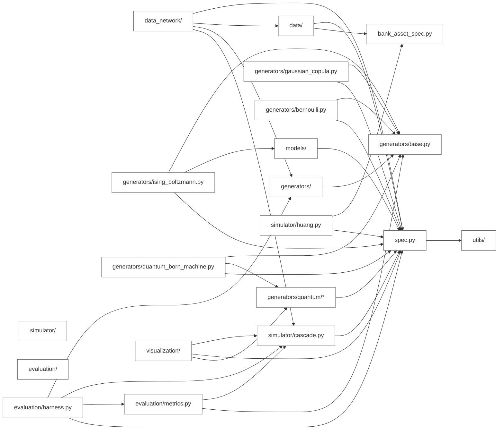
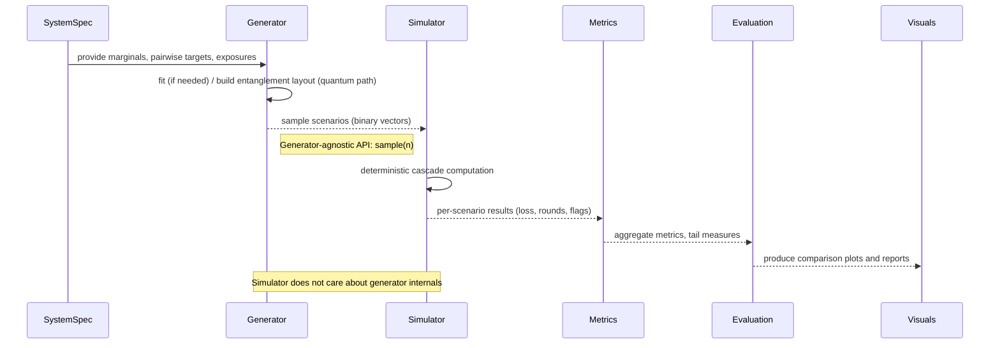

# Architecture — Quantum Systemic Stress Scenario Discovery

## Problem statement (short)

- This project compares classical scenario generators (Bernoulli, Gaussian / Student-t copula, Ising/Boltzmann) against an entanglement-structured quantum-inspired / quantum generator (Born-machine / PQC).  
- Both generator families feed the same deterministic, generator-agnostic contagion simulator.  
- The experimental design isolates the generator as the only changing variable when comparing cascade tails and systemic metrics.

---

## 2) Module-level structure (package diagram, derived from real imports)

The diagram below reflects extracted import edges between the main packages and key files in `src/systemic_risk/`. To keep the diagram presentation-friendly I grouped many submodules (e.g. visualization/*, data_network/*) and simplified dense internal quantum submodule edges; a short note about simplifications follows the diagram.



Note on simplifications: internal quantum submodules (`generators/quantum/*`) contain several internal edges (ansatz, layout, statevector, qiskit_backend). These were grouped under `QQuantum` to avoid dense clutter. `data_network/*` and `visualization/*` were similarly grouped. The diagram preserves the main cross-package import directions that matter for architecture reasoning.
  harness --> cascade
  harness --> metrics

  %% Visualization and examples
  visualization --> plots[visualization/*]
  data_network["data_network / build scripts"] --> spec
  spec --> generators
  spec --> simulator

  classDef file fill:#fff,stroke:#666,stroke-width:1px
  class spec,data,generators,simulator,evaluation,visualization,file file
```

Notes: the diagram above purposely groups many files to avoid clutter. Key source files to inspect are [src/systemic_risk/spec.py](src/systemic_risk/spec.py), [src/systemic_risk/generators/__init__.py](src/systemic_risk/generators/__init__.py), [src/systemic_risk/generators/quantum/layout.py](src/systemic_risk/generators/quantum/layout.py), [src/systemic_risk/simulator/cascade.py](src/systemic_risk/simulator/cascade.py), and [src/systemic_risk/evaluation/harness.py](src/systemic_risk/evaluation/harness.py).

---

## 3) Sequence / data-flow (scenario -> simulator -> metrics)



---

## Component responsibilities and boundaries (concise)

- `spec` / data layer ([src/systemic_risk/spec.py](src/systemic_risk/spec.py), `data_network/`): own the canonical SystemSpec / NetworkSpec, marginals, exposure totals, and provenance. They are the single canonical ground truth feeding generators and simulator.
- Generators (`src/systemic_risk/generators/`): implement a common `ScenarioGenerator` interface (`generators/base.py`). They are responsible for matching marginal probabilities and pairwise targets (moments), and for exposing `sample(n)` and `diagnostics()`. Implementations: Bernoulli, Gaussian/Student-t copula, Ising/Boltzmann, and entangled Born-machine (quantum) variants.
- Clustering / Entanglement layout (`generators/quantum/layout.py`): a deterministic, generator-agnostic pre-pass that groups tightly dependent institutions and maps them to sparse entanglers. Purpose: keep circuits sparse, interpretably place entanglement where dependencies are strongest, and allow block-separable circuits.
- Simulator (`src/systemic_risk/simulator/`): deterministic contagion cascade engines (fixed-point cascade in `cascade.py`; optional Huang fire-sale extension in `huang.py`). Accepts binary initial-default vectors and the SystemSpec; returns `CascadeResult` with losses and diagnostic traces.
- Evaluation (`src/systemic_risk/evaluation/`): `EvaluationHarness` coordinates fitting, sampling, calling `simulate_many`, computing metrics (`metrics.py`, `joint_structure.py`) and producing side-by-side comparison results. This is where generators are compared under identical simulator inputs.
- Visualization / Reports (`src/systemic_risk/visualization/`, `app/streamlit_app.py`, `examples/`): produce plots, community/network visualisations, and per-generator crisis cards.
- Tests (`tests/`): unit and integration tests exercise spec round-trips, clustering, generators, simulators, and the evaluation harness (e.g., [tests/test_data_network.py](tests/test_data_network.py), [tests/test_generators.py](tests/test_generators.py), [tests/test_huang_cascade.py](tests/test_huang_cascade.py), [tests/test_ising.py](tests/test_ising.py)).

### Boundary between generators and simulator

- Generators: produce binary scenario samples consistent with the provided SystemSpec constraints. They may use clustering/layout, circuit construction, or copula transforms internally. Their I/O contract is: `fit(spec) -> sample(n) -> ndarray(samples)`.
- Simulator: consumes binary samples and the SystemSpec and applies deterministic contagion logic. It is intentionally agnostic of how samples were produced. The contract isolates generator variance.

### Why clustering / entanglement layout exists

- Real financial dependencies are sparse and clustered. Entanglement is expensive (circuit depth, hardware connectivity), so the layout focuses entanglers where pairwise/bilateral dependency strength justifies them. This keeps quantum circuits interpretable, sparse, and financially motivated.

### How the architecture implements the problem statement

- The pipeline fixes the same spec and simulator across experiments; only the generator module changes. Evaluation collects identical simulator outputs for each generator and compares tail risk metrics, i.e., the design isolates generator impact by construction.

### How tests validate the design

- Unit tests on `spec` and `data_network` validate the canonical system building and round-trips. Generator tests confirm margin/correlation matching and sampling behaviour. Simulator tests verify deterministic cascade outcomes and the Huang engine. Integration tests in `tests/` exercise the `EvaluationHarness` end-to-end on small examples ensuring the comparison harness is reproducible.

---

## TL;DR architecture rationale

The repo cleanly separates (A) canonical system data/spec construction, (B) multiple scenario generators (classical and entangled/quantum), and (C) a single deterministic simulator and evaluation harness. This separation enforces a controlled experiment where only the generator varies, making comparison of deep-tail systemic risk both fair and reproducible. Clustering/layout localises entanglement to economically meaningful clusters, keeping quantum circuits sparse and interpretable while preserving the same simulation target.

If you want, I can now: run a quick sweep to extract individual `import` edges for a more detailed dependency graph, or generate PNG/SVG exports of the Mermaid diagrams.
